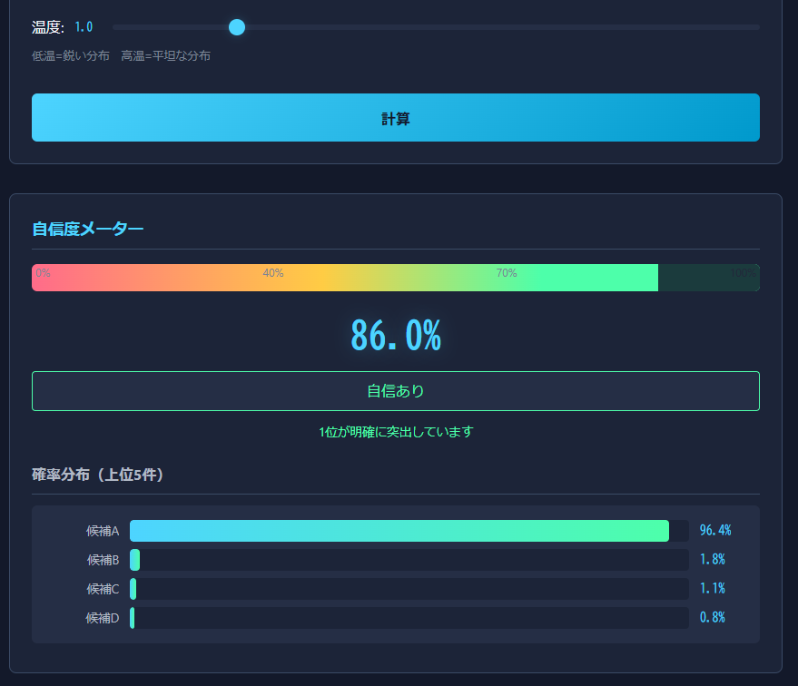

<!--
---
id: day111
slug: softmax-confidence-meter

title: "Softmax Confidence Meter"

subtitle_ja: "ソフトマックス自信度メーター"
subtitle_en: "Probability Distribution Sharpness Meter"

description_ja: "softmaxによって得られた確率分布から「この結果を信じてよいか」を測定・可視化する教育・判断支援ツール"
description_en: "An educational and decision-support tool that measures and visualizes whether you can trust the results from softmax probability distributions"

category_ja:
  - 判断支援
  - 分析・評価補助
category_en:
  - Decision Support
  - Analysis Aid

difficulty: 1

tags:
  - softmax
  - entropy
  - confidence
  - probability
  - visualization

repo_url: "https://github.com/ipusiron/softmax-confidence-meter"
demo_url: "https://ipusiron.github.io/softmax-confidence-meter/"

hub: true
---
-->

# Softmax Confidence Meter – ソフトマックス自信度メーター


[](https://ipusiron.github.io/softmax-confidence-meter/)

**Day111 - 生成AIで作るセキュリティツール200**

**Softmax Confidence Meter** は、softmaxによって得られた確率分布から「この結果を信じてよいか」を測定・可視化する教育・判断支援ツールです。

---

## 🌐 デモページ

👉 **[https://ipusiron.github.io/softmax-confidence-meter/](https://ipusiron.github.io/softmax-confidence-meter/)**

ブラウザーで直接お試しいただけます。

---

## 📸 スクリーンショット

> 
>
> *完全独走時の自信度*

---

## ✨ 主な機能

- softmax基礎の図解学習
- 自信度（Confidence）のメーター表示
- 分布の可視化

---

## 📖 Softmaxとは？（初学者向け）

**Softmax（ソフトマックス）** は、複数の候補に付けられた「スコア」を「確率」に変換する関数です。

### なぜ必要？

機械学習や統計処理では、各候補に「スコア」や「重み」が付くことがよくあります。

```
候補A: 3.5
候補B: 2.1
候補C: 0.8
```

しかしスコアのままでは：
- 「3.5と2.1はどれくらい違うのか」が直感的にわからない
- 合計値に意味がない

Softmaxを通すと、**全候補の確率の合計が100%になる**形に変換されます：

```
候補A: 71.2%
候補B: 22.1%
候補C:  6.7%
```

これにより「Aがもっとも有力で、Bも一定の可能性がある」と直感的に理解できます。

### 温度（Temperature）パラメーター

Softmaxには「温度」というパラメーターがあり、分布の鋭さを調整できます。

| 温度 | 効果 | 分布の形 |
|------|------|----------|
| **低温**（< 1.0） | 差が強調される | 1位が独走（鋭い分布） |
| **標準**（= 1.0） | そのまま変換 | バランスの取れた分布 |
| **高温**（> 1.0） | 差が緩和される | 均等に近づく（平坦な分布） |

### よくある誤解

| 誤解 | 正しい理解 |
|------|------------|
| 「確率80%なら正しい」 | Softmax出力は相対的な比率であり、絶対的な正解確率ではない |
| 「1位を選べば安全」 | 2位との差が小さければ、どちらも同程度に妥当 |
| 「スコアが高い＝確率が高い」 | 他の候補のスコア次第で確率は変わる（相対比較） |

---

## 🔄 softmaxの入出力

| 項目 | 説明 |
|------|------|
| **入力** | 任意のスコア値（合計が1や100である必要なし） |
| **出力** | 確率分布（必ず合計100%になる） |

入力スコアの絶対値や合計値に制約はありません。softmaxは相対的な大小関係を確率分布に変換します。

---

## 🔬 自信度の算出方法

自信度は**正規化エントロピー**を用いて算出されます。

```
Confidence = (1 - H / log(N)) × 100 [%]
```

- `H`: 確率分布のエントロピー（不確実性の指標）
- `N`: 候補の数
- `log(N)`: 最大エントロピー（全候補が均等な場合）

### 判定ラベル

| 自信度 | ラベル | 意味 |
|--------|--------|------|
| 70% 以上 | 自信あり | 1位候補が明確に突出している |
| 40% 〜 70% | 判断が分かれる | 複数の候補が競合している |
| 40% 未満 | 判断困難 | 分布がほぼ均等で決め手がない |

---

## 🎯 活用例

### 1. 古典暗号の解読支援

シーザー暗号や換字式暗号の解読で、複数の復号候補が得られた場合に活用できます。

**シナリオ**: 暗号文を頻度分析で解読し、各シフト量に対するスコアが得られた

```
シフト3:4.2
シフト7:2.1
シフト11:1.8
シフト19:0.9
```

**判断**: 自信度が70%以上なら「シフト3で復号してよい」、40%未満なら「他の手法も併用すべき」と判断できます。

---

### 2. 機械学習モデルの出力検証

分類モデルや推薦システムの出力を鵜呑みにせず、判断の確からしさを評価します。

**シナリオ**: 画像分類モデルが出力したクラス別スコア

```
猫:3.8
犬:3.5
うさぎ:2.9
鳥:1.2
```

**判断**: 「猫」と「犬」のスコアが近い場合、自信度は低くなります。1位だけを見て決め打ちせず、上位2つを人間が確認するワークフローを検討できます。

---

### 3. LLMの出力選択支援

LLM（大規模言語モデル）が複数の候補を生成した際、どの候補を採用すべきか判断します。

**シナリオ**: LLMが生成した翻訳候補とその内部スコア

```
候補A（直訳）:2.8
候補B（意訳）:2.6
候補C（フォーマル）:2.4
候補D（カジュアル）:1.5
```

**判断**: 上位3つが拮抗している場合（自信度40〜70%）、自動選択せずユーザーに選択肢を提示するUIが適切と判断できます。

---

## 🔗 関連ツール

本ツールと関連する姉妹ツールを紹介します。

### 🔐 Token Entropy Estimator

Softmax Confidence Meter では、候補スコアを softmax によって確率分布へ変換し、その分布の「尖り具合」から自信度を測定しています。この尖り具合は**エントロピー（不確実性）** としても解釈できます。

Token Entropy Estimator は、文字列やトークン列そのもののエントロピーを可視化するツールです。

> **本ツールとの違い**: 「結果の分布がどれだけはっきりしているか」を見る本ツールに対し、「入力データ自体がどれだけ秩序立っているか」を見るのが Token Entropy Estimator の役割です。

- 📂 GitHub: [ipusiron/token-entropy-estimator](https://github.com/ipusiron/token-entropy-estimator)
- 🚀 デモ: [https://ipusiron.github.io/token-entropy-estimator/](https://ipusiron.github.io/token-entropy-estimator/)

### 📐 InfoQuantity Academy

Softmax Confidence Meter が扱っている「自信度」「分布の尖り」「判断のしやすさ」は、情報量やエントロピーといった**情報理論の考え方**と深く関係しています。

InfoQuantity Academy は、これらの概念を数式ではなく図解と直感で理解するための学習用ツールです。

> **本ツールとの関係**: softmax の挙動や自信度の意味をもう一段深く理解したい場合に、理論的な背景を補完する役割を持っています。

- 📂 GitHub: [ipusiron/infoquantity-academy](https://github.com/ipusiron/infoquantity-academy)
- 🚀 デモ: [https://ipusiron.github.io/infoquantity-academy/](https://ipusiron.github.io/infoquantity-academy/)

---

## 📁 ディレクトリー構造

```
softmax-confidence-meter/
├── index.html          # メインHTML
├── css/
│   └── style.css       # スタイルシート
├── js/
│   └── main.js         # softmax計算・UI制御
├── docs/
│   ├── SPEC.md         # 仕様書
│   └── UI_SPEC.md      # UI仕様書
├── assets/             # 画像リソース
│   └── screenshot.png  # スクリーンショット
├── CLAUDE.md           # Claude Code用ガイド
├── LICENSE             # ライセンスファイル
└── README.md           # 本ドキュメント
```

---

## 📄 ライセンス

- ソースコードのライセンスは `LICENSE` ファイルを参照してください。

---

## 🛠️ このツールについて

本ツールは、「生成AIで作るセキュリティツール200」プロジェクトの一環として開発されました。
このプロジェクトでは、AIの支援を活用しながら、セキュリティに関連するさまざまなツールを200日間にわたり制作・公開していく取り組みを行っています。

プロジェクトの詳細や他のツールについては、以下のページをご覧ください。

🔗 [https://akademeia.info/?page_id=44607](https://akademeia.info/?page_id=44607)
